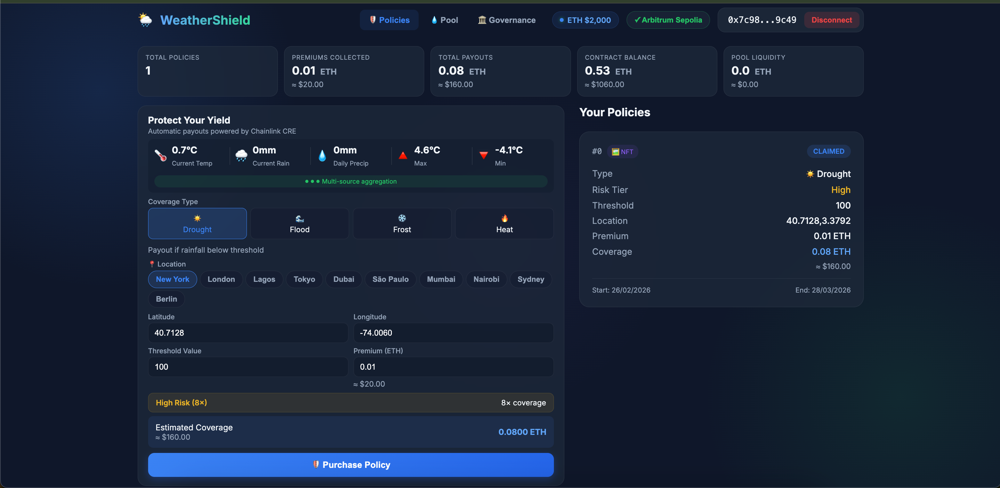

# WeatherShield 🌦️

[](https://soliditylang.org/)
[](https://chain.link/)
[](LICENSE)

**Parametric weather insurance that pays out automatically when conditions hit a threshold. No claims process, no paperwork, no waiting around.**

> I built WeatherShield to solve a real problem — crop insurance is slow, expensive, and unfair. This protocol uses Chainlink CRE to pull weather data and trigger on-chain payouts automatically. No backend server, no middleman.

> Built for Chainlink Block Magic Hackathon 2026 — DeFi Track

---

## Demo

| Resource | Link |
|----------|------|
| **Live App** | [weathershield-app.vercel.app](https://weathershield-app.vercel.app) |
| **Video Demo** | [YouTube](https://youtu.be/VsvxXYtLxF4) |
| **Contract** | [Arbiscan](https://sepolia.arbiscan.io/address/0x0988119B3526C21129E0254f5E8bd995Bed51F6D) |

---

## Screenshot

<p align="center">
  
</p>

---

## The Problem

I looked into how crop insurance works and it's honestly terrible:
- Claims take weeks or months
- Farmers have to prove damage with paperwork
- Adjusters make subjective calls
- Admin costs eat into payouts
- In many developing countries, it's just not available at all

## The Solution

WeatherShield uses **parametric insurance** — the idea is simple: if weather conditions cross a threshold, the payout happens automatically. No claim forms, no inspectors, no delays.

- Funds arrive in minutes, not months
- Trigger conditions are transparent and on-chain
- Works for any location with weather data

Parametric insurance is already being used in developing countries by organizations like the World Food Programme. I wanted to bring that model on-chain and let Chainlink CRE handle the automation part.

---

## Chainlink Integration

CRE is what makes this project work without a backend. Here are the key files:

- **Workflow**: [cre-workflows/weather-monitor.yaml](cre-workflows/weather-monitor.yaml) — the actual CRE workflow definition
- **Contract**: [contracts/WeatherShield.sol](contracts/WeatherShield.sol) — protected by an `onlyCRE` modifier
- **Simulation**: [scripts/cre-simulate.js](scripts/cre-simulate.js) — I wrote this to test the CRE logic locally
- **Config**: [cre.config.yaml](cre.config.yaml)

## Why Chainlink CRE?

I needed something that could:
- Fetch weather data on a schedule without me running a server
- Check trigger conditions and call the contract automatically
- Do all of this without a centralized backend

CRE handles all three. Without it, I'd need to run my own server with a cron job polling the weather API and submitting transactions — that's a single point of failure and defeats the purpose of building on-chain.

---

## Architecture

<p align="center">
  
</p>

---

## How It Works

### User Flow
1. Connect wallet — app asks to switch to Arbitrum Sepolia if needed
2. Pick a coverage type — drought, flood, frost, or heat
3. Set a threshold — like "pay me if rainfall drops below 10mm"
4. Pay a premium — coverage is 10x whatever premium is paid
5. CRE monitors weather every 6 hours
6. If conditions trigger, payout lands in the wallet automatically

### CRE Workflow

The `weather-monitor.yaml` workflow kicks off every 6 hours:

| Step | Action | Details |
|------|--------|---------|
| 1 | **Fetch** | HTTP GET to Open-Meteo API for weather |
| 2 | **Transform** | Convert readings to int256 (scaled by 10) |
| 3 | **Update** | Call `updateWeatherData()` on contract |
| 4 | **Check** | Call `isPolicyClaimable()` for active policies |
| 5 | **Payout** | If triggered, call `processClaim()` |

### Trigger Logic

| Type | Condition | Example |
|------|-----------|---------|
| Drought | rainfall < threshold | Less than 10mm rain |
| Flood | rainfall > threshold | More than 100mm rain |
| Frost | temp < threshold | Below 0°C |
| Heat | temp > threshold | Above 40°C |

---

## Use Cases

**Farmers** — A farmer buys drought protection before planting season. If rainfall drops below their threshold, they get paid automatically.

**Event Organizers** — Running an outdoor festival? Buy rain or heat cover. If the weather ruins the event, payout helps cover refund costs.

**Supply Chain** — Shipping temperature-sensitive goods? Set a frost trigger. If temps drop during transit, payout covers the spoilage.

**Renewable Energy** — Could be extended to hedge against low solar or wind output (not built yet, but the contract supports it).

---

## Quick Start

### What I used
- Node.js 18+
- MetaMask (or any EVM wallet)
- Arbitrum Sepolia ETH — grab some from the [faucet](https://faucet.quicknode.com/arbitrum/sepolia)

### Install

```bash
git clone https://github.com/AdekunleBamz/weathershield.git
cd weathershield
npm install
cd frontend && npm install && cd ..
```

### Run Tests

```bash
npx hardhat test
```

> 11 tests passing — covers policy creation, claims, access control, and edge cases.

### Run Frontend

```bash
cd frontend && npm run dev
```

### Simulate CRE Workflow

I built a simulation script ([scripts/cre-simulate.js](scripts/cre-simulate.js)) to test the CRE logic locally without deploying a workflow:

```bash
node scripts/cre-simulate.js
node scripts/cre-simulate.js --type 0 --threshold 100
node scripts/cre-simulate.js --lat 34.05 --lon -118.24 --type 3
```

<details>
<summary>Example output</summary>

```
--- WeatherShield CRE Simulation ---

Location: 40.7128, -74.006
Type: Drought (0)
Threshold: 100

Fetching weather from Open-Meteo...

Weather data:
  Temp: -4.4°C
  Rain: 0mm
  Daily precip: 0mm
  Daily max: -1.4°C
  Daily min: -9.8°C

Contract value: 0 (0mm)
Trigger: value < 100? YES

✓ CLAIM WOULD TRIGGER
```

</details>

---

## Project Structure

- [contracts/WeatherShield.sol](contracts/WeatherShield.sol) — the main contract, handles policies and payouts
- [cre-workflows/weather-monitor.yaml](cre-workflows/weather-monitor.yaml) — CRE workflow that checks weather every 6 hours
- [frontend/](frontend/) — React + Vite dashboard
- [scripts/cre-simulate.js](scripts/cre-simulate.js) — my local simulation script for testing CRE logic
- [test/WeatherShield.test.cjs](test/WeatherShield.test.cjs) — 11 tests covering the important stuff
- [cre.config.yaml](cre.config.yaml) — CRE config

---

## Security

A few things I made sure to get right:

- **Access control** — only the CRE-authorized address (or contract owner) can update weather data or process claims. There's an `onlyCRE` modifier for this.
- **Reentrancy** — all ETH transfers go through OpenZeppelin's `ReentrancyGuard`. Not taking chances.
- **Funding** — the contract needs to hold enough ETH before it can pay out. Owner deposits via `depositFunds()` and balance is checked before any claim.

> ⚠️ This is deployed on Arbitrum Sepolia for demo purposes. It hasn't been audited — don't use it with real money.

---

## Limitations

Things I know could be better:
- Only pulling from one weather API right now (Open-Meteo). Ideally I'd verify across multiple sources.
- Premium pricing is flat — should be dynamic based on location risk.
- Policies aren't tokenized yet (NFTs would make them tradeable).
- One location per policy. Area-based coverage would be more practical.

---

## What I'd Build Next

- [ ] Deploy on multiple chains
- [ ] Area-based policies instead of single coordinates
- [ ] Pull weather from multiple sources for verification
- [ ] Dynamic pricing based on actual risk
- [ ] Make policies tradeable as NFTs
- [ ] DAO governance for protocol parameters

---

## Deployed Contract

| Network | Address |
|---------|---------|
| Arbitrum Sepolia | `0x0988119B3526C21129E0254f5E8bd995Bed51F6D` |

---

## Tech Stack

- Solidity 0.8.24 + OpenZeppelin
- Hardhat + Chai
- Chainlink CRE
- Open-Meteo API (free)
- React + Vite + ethers.js
- Arbitrum Sepolia

---

## License

MIT

---

Built by [@AdekunleBamz](https://github.com/AdekunleBamz) — Chainlink Block Magic Hackathon 2026
